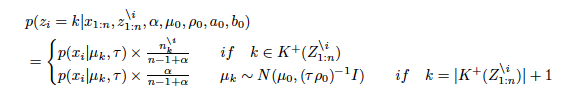
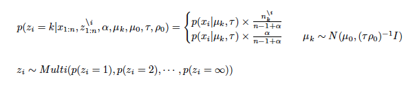
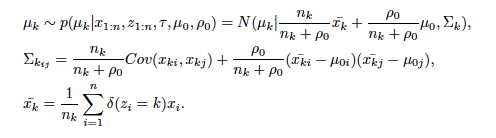
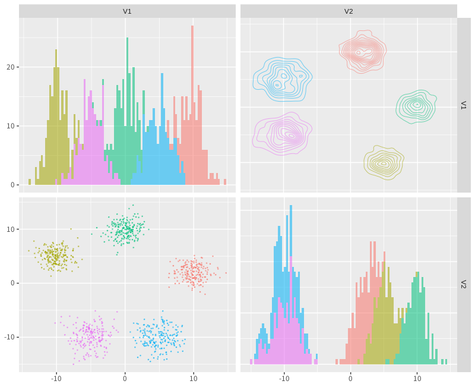

# Apache PredictionIO Template: Bayesian Nonparametric Chinese Restaurant Process Clustering
  
## Abstract
Clustering is a scientific method which finds the clusters of data and many related methods are traditionally researched for long terms. Bayesian nonparametrics is statistics which can treat models having infinite parameters. Chinese restaurant process is used in order to compose Dirichlet process. The clustering which uses Chinese restaurant process does not need to decide the number of clusters in advance. This algorithm automatically adjusts it. Then, this PredictionIO template can calculate the cluster which data join in.

## Introduction
Clustering is a traditional method in order to find the clusters of data and many related methods are studied for several decades. The most popular method is called as K-means [@Hartigan1979]. K-means is an algorithmic way in order to search the clusters of data. However its method needs to decide the number of clusters in advance. Therefore if the data is both high dimensions and a complex, deciding the accurate number of clusters is difficult and normal Bayesian methods are too. For that reason, Bayesian nonparametric methods are gradually important as computers are faster than ever. In this package, we implemented Chinese restaurant process clustering  (CRP) [@Pitman1995]. CRP can compose infinite dimensional parameters as Dirichlet process [@Ferguson1973]. It acts like customers who sit at tables in a restaurant and has a probability to sit at a new table. As a result, Its model always automates clustering. Then, we explain the clustering model and how to use it in detail. Finally, an example is plotted on a graph.

## Background
### Chinese Restaurant Process
Chinese restaurant process is a metaphor looks like customers sit at a table in Chinese restaurant. All customers except for x_i have already sat at finite tables. A new customer x_i will sit at either a table which other customers have already sat at or a new table. A new customer tends to sit at a table which has the number of customers more than other tables. A probability equation is given by    



where n^i_k denotes the number of the customers at a table k except for i and α is a concentration parameter.

### Markov Chain Monte Carlo Methods for Clustering
Markov chain Monte Carlo (MCMC) methods [@Liu1994] are algorithmic methods to sample from posterior distributions. If conditional posterior distributions are given by models, it is the best way in order to acquire parameters as posterior distributions. The algorithm for this package is given by    

Many iterations continue on below:  

i) Sampling z_i for each i (i = 1,2, ・・・,n)



where k is a k th cluster and i is a i th data. mu and sigma_table arguments in the "crp_gibbs" function are generating mu_k parameter for new table.  

ii) Sampling u_k for each k (k = 1,2, ・・・,∞)



Sigma_k is a variance-covariance matrix of k th cluster. i and j are rows and columns' number of Sigma_k. rho_0 is a argument ro_0 in "crp_gibbs" function. First several durations of iterations which are called as "burn in" are error ranges. For that reason, "burn in" durations are abandoned.  

## Installation
Template is available through GitHub (https://github.com/jirotubuyaki/predictionio-template-crp-clustering)). You can download by the commands:

```
> git clone https://github.com/jirotubuyaki/predictionio-template-crp-clustering.git crp_clustering
> cd crp_clustering
```

Next you can init new App and please change "AppName" in "engine.json"  
"dimention" is data dimention. Please change for your data:  
```
{
  "id": "crp clustering",
  "description": "",
  "engineFactory": "com.template.crp_clustering.CRPEngine$",
  "datasource": {
    "params" : {
      "appName": "MyApp",
      "appId": 2,
      "dimention" : 2   // "dimention" must change for your data.
    }
  }
```

```
> pio app new MyApp
> pio build --verbose
```

Once the template are installed and compiled, you can input json style data and train model by the command:  
Please check "input.json" in data" directory and its format is used in the template.   

```
Train data format in "input.json".

{"event": "action","entityType": "user","entityId": "1","properties": {"dim_1": -0.477335,"dim_2": 2.00413276}}

> pio import --appid 2 --input ./data/input.json 
```

After init and build, you can train model. If no error, you can deploy the template: 

```
> pio train
> pio deploy
```

For predict, query is this style below. If you change data dimention, please improve "build.json" and quey style.    

```
{"point": 2.5, "point": -1.0}                   // for 2 dimention query
{"point": 2.5, "point": -1.0, "point": 0.5}     // for 3 dimention query
```

```
> curl -H 'Content-Type: application/json' '127.0.0.1:8000/queries.json' -d '{"point": 2.5,"point": -1.0}'
```

## Methods
### Parameters for Chinese Restaurant Process Clustering
It is "engine.json" file. You can set model parameters. 
```
   "algorithms": [
    {
      "name": "algo",
      "comment": "",
      "params": {
        "mu": [0.0,0.0],
        "sigma_table": 1,
        "alpha": 1,
        "ro_0": 1,
        "burn_in": 100,
        "iteration": 1000
      }
    }
  ]
```

Let arguments be:  .  
  ・ mu : a vector of center points of data. If data is 3 dimensions, a vector of 3 elements like "[2, 4, 1]".  
  ・ sigma_table : a numeric of table position variance.  
  ・ alpha : a numeric of a CRP concentration rate.  
  ・ ro_0 : a numeric of a CRP mu change rate.  
  ・ burn_in : an iteration integer of burn in.  
  ・ iteration : an iteration integer.    

## Example
Data is generated from five distributions and parameters are set as mu=c(0, 0, 0), alpha=1, sigmatable=1, rho_0=1, burnin=100, iteration=1000. The result is plotted on a graph and each data joins in any cluster. The graph is given by below:



　　　　　　　　　　　　　　　　　　　　　Figure 1. CRP clustering result

## Conclusions
Chinese restaurant process clustering was implemented and explained how to use it. After this, several improvements are planed. Please send suggestions and report bugs to okadaalgorithm@gmail.com.

## Acknowledgments
This activity would not have been possible without the support of my family and friends. To my family, thank you for much encouragement for me and inspiring me to follow my dreams. I am especially grateful to my parents, who supported me all aspects.  

## References
Ferguson, Thomas. 1973. “Bayesian Analysis of Some Nonparametric Problems,” Annals of Statistics. 1 (2):
209–230.  

Hartigan, M. A., J. A.; Wong. 1979. “Algorithm as 136: A K-Means Clustering Algorithm,” Journal of the Royal Statistical Society, SeriesC. 28 (1): 100–108. JSTOR 2346830.

Liu, Jun S. 1994. “The Collapsed Gibbs Sampler in Bayesian Computations with Applications to a Gene Regulation Problem,” Journal of the American Statistical Association 89 (427): 958–966.

Pitman, Jim. 1995. “Exchangeable and Partially Exchangeable Random Partitions,” Probability Theory and Related Fields 102 (2): 145–158.   
